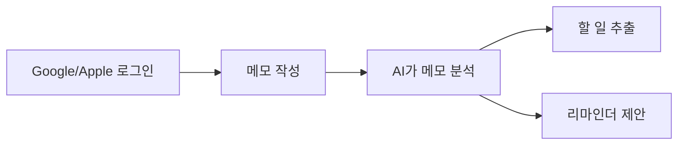

# Spectra — AI 메모 정리 & 할 일 관리

- App Store: [apps.apple.com](https://apps.apple.com/kr/app/spectra-%EB%A9%94%EB%AA%A8%EB%A1%9C-%EC%A0%95%EB%A6%AC%ED%95%98%EB%8A%94-%ED%95%A0-%EC%9D%BC%EA%B3%BC-%EB%A6%AC%EB%A7%88%EC%9D%B8%EB%8D%94/id6766253912)
- Google Play: [play.google.com](https://play.google.com/store/apps/details?id=co.spectra.app&hl=ko)
- 개인정보처리방침: [spectra.sanglimsoft.com/privacy](https://spectra.sanglimsoft.com/privacy/)
- 고객지원: [spectra.sanglimsoft.com/support](https://spectra.sanglimsoft.com/support/)

**Spectra**는 자유롭게 적은 메모를 AI가 정리해 할 일을 추출하고, 리마인더까지 제안해주는 앱입니다. Google/Apple 계정으로 간편하게 로그인해 이용합니다.

## 어떻게 동작하나요

## 이런 분께 추천합니다

- 생각나는 대로 메모부터 하고 정리는 나중에 하고 싶은 분
- 메모 속에 흩어진 할 일을 놓치고 싶지 않은 분

## 주요 기능

- AI 기반 메모 정리 및 할 일 자동 추출
- 리마인더 제안
- Google/Apple OAuth 로그인
